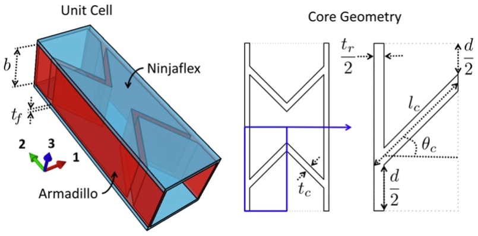

This code models a representative volume element (RVE) of an accordion core sandwich panel. The panel exhibits directional mechanical properties: it is flexible along one axis and stiff along the perpendicular axis, making it suitable for applications requiring anisotropic behavior.

As the finite element analysis of the full-scale panel is computationally expensive, it restricts the analysis of large structures with such complex underlying panels. This code homogenizes the mechanical response of the RVE to an equivalent shell stiffness matrix. The large structure can then be modeled as a shell surface with the homogenized stiffness matrix representing the panel's stiffness properties.

If you use this code in your research or publications, please cite it as follows:

N. M. Mahid, M. Schenk, B. Titurus, and B. K. S. Woods,  
“Parametric design studies of GATOR morphing fairings for folding wingtip joints,”  
*Smart Materials and Structures*, vol. 34, no. 2, p. 25049, Jan. 2025.  
[https://doi.org/10.1088/1361-665x/adad21](https://doi.org/10.1088/1361-665x/adad21)
