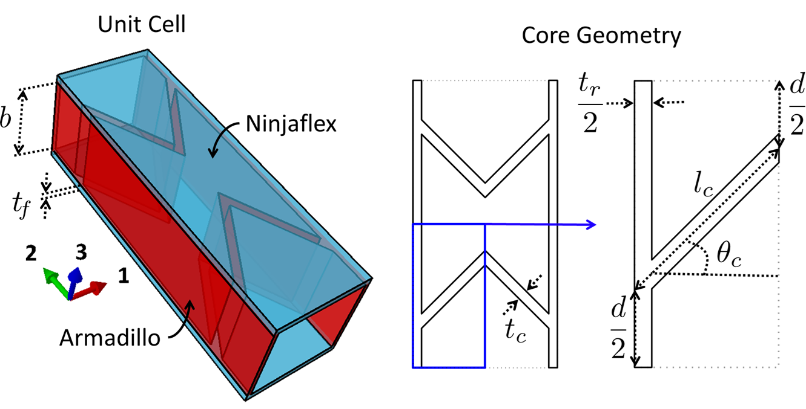

This script provides a second-order homogenisation scheme for a cellular sandwich panel. The representative volume element (RVE) of the panel is modelled using solid elements with different material properties for the core and the facesheet.

As the feature size (e.g., chevron) of the unit cell is small, the RVE model requires a fine mesh to produce accurate results. Hence, any analysis of such a sandwich panel is computationally expensive for large structures.

An alternative approach is multi-scale modelling, where the equivalent shell stiffness of the sandwich panel is evaluated through a homogenisation scheme, followed by the analysis of the large structure by representing it as a shell surface with the homogenised shell stiffness properties.

This script creates a symmetric mesh for the RVE model using [GMSH](https://gmsh.info), applies periodic boundary conditions on the lateral face nodes, and evaluates the equivalent shell stiffness of the panel by solving the boundary value problem using linear perturbations in Abaqus.

If you use this code in your research or publications, please cite it as follows:

N. M. Mahid, M. Schenk, B. Titurus, and B. K. S. Woods,  
“Parametric design studies of GATOR morphing fairings for folding wingtip joints,”  
*Smart Materials and Structures*, vol. 34, no. 2, p. 25049, Jan. 2025.  
[https://doi.org/10.1088/1361-665x/adad21](https://doi.org/10.1088/1361-665x/adad21)
